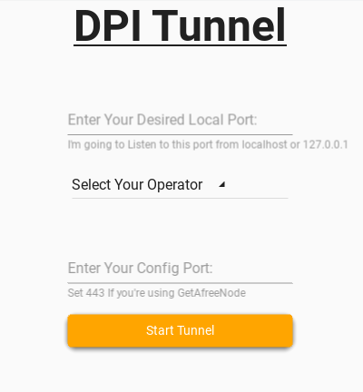

# DPI Tunnel README

DPI Tunnel is a Python application that helps users bypass internet censorship and surveillance by creating an encrypted tunnel between the user's device and a server and with help of spliting client hello packet. 

It uses Cloudflare IP addresses to avoid detection and supports multiple Iranian operators.

This project was built using Python and other tools such as Kivy and KivyMD.

## Screenshot

## Features

* Easy-to-use graphical user interface
* Supports manual and automatic selection of Cloudflare IP addresses
* Supports multiple Iranian operators (Hamrah-Aval, Irancell, Rightel, Mokhaberat, HiWeb, AsiaTech, Shatel, ParsOnline, MobinNet, Andishe-Sabz-Khazar, Respina, AfraNet, Zi-Tel, Pishgaman, Araax, SamanTel, FanAva, DidebanNet, ApTel, Fanap-Telecom, RayNet)

## Download
You can download the latest version of DPI Tunnel from [data/bin](https://github.com/yebekhe/DPI-TLS-Tunnel/tree/data/bin) directory. 

After downloading the file, install it and follow "How to Use" steps to start using the application.

## How to Use

1. Enter your desired local port in the "Enter Your Desired Local Port" field.
2. Select your operator from the dropdown menu.
3. Enter your Cloudflare IP address or leave it empty to use the automatically selected IP.
4. Enter your config port in the "Enter Your Config Port" field. 
5. Click the "Start Tunnel" button to start the tunnel.
6. To stop the tunnel, click the "Stop Tunnel" button.

## Credits

This project was inspired by [GFW-knocker/gfw_resist_tls_proxy](https://github.com/GFW-knocker/gfw_resist_tls_proxy). Thanks to the creators of this project for their contributions to internet freedom.
